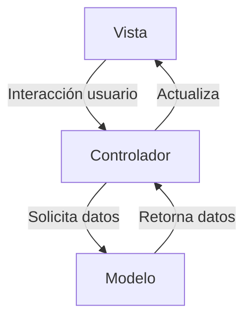
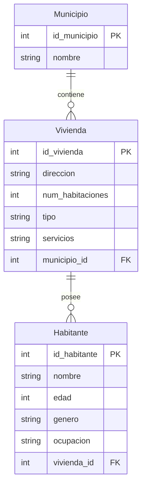

<div align="center">

# 🏠 Censo de Vivienda y Población

### *Sistema de registro y análisis estadístico de datos censales*


[📚 Instalación](#-guía-de-instalación) · [📊 Funcionalidades](#-características-principales) · [🧩 Arquitectura MVC](#-arquitectura-mvc) · [👥 Equipo](#-equipo-de-desarrollo)

</div>

---

## 📋 Tabla de Contenidos

- [🎯 Visión General](#-visión-general)
- [✨ Características Principales](#-características-principales)
- [🧩 Arquitectura MVC](#-arquitectura-mvc)
- [🗄️ Base de Datos](#️-base-de-datos)
- [🚀 Guía de Instalación](#-guía-de-instalación)
- [📊 Ejemplo de Uso](#-ejemplo-de-uso)
- [👥 Equipo de Desarrollo](#-equipo-de-desarrollo)
- [📄 Licencia](#-licencia)

---

## 🎯 Visión General

> **Censo Vivienda y Población** es una aplicación de escritorio que permite registrar, consultar y analizar información sobre viviendas y habitantes en una comunidad.

El sistema fue diseñado con el propósito de **simular un proceso censal real**, permitiendo almacenar información demográfica y habitacional, generar reportes y visualizar estadísticas mediante gráficos o tablas.  

Su diseño sigue el patrón **Modelo–Vista–Controlador (MVC)** para asegurar un mantenimiento limpio y escalable del código.

---

## ✨ Características Principales

<table>
<tr>
<td width="50%">

### 🏘️ **Gestión de Viviendas**

- 🏠 Registro de viviendas con datos estructurales y ubicación  
- 🧱 Tipo de vivienda, número de habitaciones, servicios disponibles  
- 🔍 Búsqueda y filtrado por criterios  
- 🗑️ Eliminación y edición de registros  

</td>
<td width="50%">

### 👨‍👩‍👧‍👦 **Gestión de Habitantes**

- 🧾 Registro de personas por vivienda  
- 📅 Datos demográficos (edad, género, ocupación, escolaridad)  
- 🔗 Relación con vivienda (propietario, inquilino, etc.)  
- 📊 Estadísticas por grupo de edad o género  

</td>
</tr>
</table>

---

## 🧩 Arquitectura MVC

<div align="center">


</div>
- Modelo: Clases que representan entidades como Vivienda, Habitante, Municipio.
- Vista: Formularios y componentes de interfaz gráfica (Swing).
- Controlador: Maneja la lógica de eventos y la comunicación entre modelo y vista.
- DAO (Data Access Object): Separa la lógica de acceso a base de datos.

---

## 🗄️ Base de Datos

### 📦 Archivos SQL Incluidos
| Archivo                           | Descripción                    |
| --------------------------------- | ------------------------------ |
| `censo_vivienda_poblacion_db.sql` | Script para creación de tablas |
| `InsertIntoTables_query.sql`      | Inserta viviendas de ejemplo   |
| `InsertIntoHabitantes_query.sql`  | Inserta habitantes de prueba   |

---

## 🚀 Guía de Instalación
### 📋 Prerrequisitos
- ☕ Java 8+
- 🧱 NetBeans IDE 8.x o superior
- 🗄️ Motor de Base de Datos (MySQL o SQL Server)
- 🧩 Conector JDBC

### 🧰 Instalación Paso a Paso
#### 1️⃣ Clonar el repositorio
```
git clone https://github.com/guco-17/censo-vivienda-poblacion.git
cd censo-vivienda-poblacion
```
#### 2️⃣ Crear la base de datos
Ejecuta en tu gestor SQL:
```
SOURCE censo_vivienda_poblacion_db.sql;
SOURCE InsertIntoTables_query.sql;
SOURCE InsertIntoHabitantes_query.sql;
```
#### 3️⃣ Configurar la conexión en el proyecto
Edita la clase Conexion.java o el archivo de configuración y reemplaza con tus credenciales:
```
private static final String URL = "jdbc:mysql://localhost:3306/censo_db";
private static final String USER = "root";
private static final String PASSWORD = "tu_contraseña";
```
#### 4️⃣ Ejecutar el proyecto
Abre el proyecto en NetBeans
Ejecuta la clase principal Main.java
¡Listo! La interfaz principal del censo se abrirá en pantalla

---

## 📊 Ejemplo de Uso
- 👤 Registrar vivienda ➜ ID automático
- 🏠 Agregar 3 habitantes ➜ asociados a esa vivienda
- 📈 Consultar estadísticas ➜ promedio de habitantes por vivienda
- 📄 Generar reporte ➜ impresión de datos

---

## 👥 Equipo de Desarrollo
<table align="center">
  <tr>
    <td align="center">
      
      <br />
      <sub><b>Sebastian Chapa</b></sub>
      <br />
      <sub>Full Stack Developer</sub>
    </td>
    <td align="center">
      
      <br />
      <sub><b>Gustavo Cortes</b></sub>
      <br />
      <sub>Full Stack Developer</sub>
    </td>
  </tr>
</table>

---

## 📄 Licencia

Este proyecto fue desarrollado como parte de un proyecto educativo.

---
<div align="center">

### 🌟 ¿Te gustó el proyecto? ¡Dale una estrella! ⭐

**Hecho por Sebastian Chapa y Gustavo Cortes**

</div>
